# ALWAYS FIT CASEFLOW — FLUXO DE SAÚDE COM DEVOLUÇÃO, TROCA OU ESTORNO

**Código do fluxo:** `SAUDE-DEV-TROCA-ESTORNO`<br>
**Versão:** `0.1`<br>
**Data:** `2026-07-15`<br>
**Status:** Rascunho operacional consolidado para institucionalização no AlwaysTrack CaseFlow<br>
**Origem:** Fluxo real descrito pelo SAC da Always Fit<br>
**Observação:** Este documento descreve o fluxo operacional vigente informado. Pontos não confirmados aparecem como **PENDÊNCIA PARA VALIDAÇÃO**.

---

# 1. Identificação

- **Nome do fluxo:** Problema de saúde após uso de suplemento — devolução, troca ou estorno
- **Código curto e estável:** `SAUDE-DEV-TROCA-ESTORNO`
- **Objetivo operacional:** Guiar o atendente desde o relato inicial de mal-estar após o uso de um suplemento até a conclusão por acolhimento, logística reversa, troca, estorno ou solução mista.
- **Problema que resolve:** Atendimentos em que o cliente informa que utilizou produto(s) da Always Fit, apresentou mal-estar ou alteração de saúde e deseja devolver, trocar ou receber o valor correspondente.
- **Equipe responsável:** SAC Always Fit
- **Perfis autorizados:**
  - Atendente SAC
  - Supervisão/liderança, para exceções fora do padrão
- **Prioridade:** Alta
- **Sistemas envolvidos:**
  - AlwaysChat
  - Yampi
  - Rastreio
  - Lançador
  - Correios — logística reversa
  - Slack
  - Fonte da nota fiscal/valores do pedido
- **Versão e data do procedimento:** `v0.1 — 15/07/2026`

---

# 2. Escopo

## 2.1 Situações em que o fluxo deve ser iniciado

Iniciar quando o cliente relatar, de forma direta ou vaga, que:

- tomou um produto ou kit da Always Fit;
- sentiu-se mal;
- apresentou aumento ou queda de pressão;
- teve tontura, palpitação, enjoo, dor, fraqueza ou outro mal-estar;
- acredita que o produto provocou alguma reação;
- deseja devolver produtos por medo de continuar usando;
- deseja trocar ou receber de volta o valor pago após um episódio de saúde.

Exemplo fictício:

> “Tomei o produto de vocês e minha pressão subiu.”

## 2.2 Situações fora do escopo

- Cliente apenas não percebeu resultado, sem qualquer relato de mal-estar.
- Dúvida preventiva sobre contraindicação antes do uso.
- Reclamação de qualidade puramente visual, sem relato de saúde.
- Pedido de diagnóstico, prescrição ou ajuste de tratamento.
- Logística reversa sem relação com problema de saúde.
- Reenvio por item faltante, extravio ou produto trocado.

## 2.3 Pré-condições

- O cliente deve ser identificado.
- O pedido relacionado deve ser localizado.
- A data de **recebimento** deve ser verificada.
- Os produtos envolvidos devem ser identificados na medida do possível.
- O atendente deve confirmar quais itens o cliente não conseguirá mais utilizar.

## 2.4 Informações mínimas necessárias

- Nome do cliente.
- CPF usado na compra.
- Pedido relacionado.
- Data de recebimento.
- Produto(s) ou kit(s) envolvidos.
- Data ou período aproximado de início do mal-estar.
- Forma de uso.
- Medicamentos ou outros suplementos utilizados ao mesmo tempo.
- Quais produtos estão abertos.
- Quais produtos estão lacrados com o lacre interno intacto.
- Quais produtos o cliente não pretende mais utilizar.
- Forma de pagamento original.
- Escolha final entre troca, estorno ou solução mista.

## 2.5 Resultado esperado

O cliente deve sair com o valor integral correspondente ao escopo que ficou impossibilitado de usufruir, por uma destas formas:

- estorno;
- troca;
- troca + estorno da diferença;
- troca + pagamento complementar do cliente;
- acolhimento sem solução financeira, quando fora do prazo e sem exceção aprovada.

## 2.6 Critérios de encerramento

O fluxo pode ser encerrado quando:

- o estorno foi solicitado e registrado;
- a troca foi gerada e o rastreio enviado;
- a solução mista foi completamente executada;
- o cliente desistiu de devolver ou trocar após receber orientação;
- o pedido está fora dos 30 dias e não houve exceção aprovada;
- uma ação já foi processada e não pode mais ser alterada;
- o cliente foi orientado a procurar atendimento médico quando o mal-estar permanece.

---

# 3. Entradas

| Campo | Descrição | Tipo | Obrigatório | Origem | Exemplo fictício | Validação | Dado pessoal/sensível | Decisões que utiliza |
|---|---|---:|---:|---|---|---|---|---|
| `nome_cliente` | Nome usado na apresentação e mensagens | Texto | Sim | AlwaysChat/Yampi | Maria Silva | Não vazio | Pessoal | Todas |
| `cpf_cliente` | CPF utilizado na compra | Texto | Sim | AlwaysChat, Yampi ou cliente | 000.000.000-00 | CPF em formato válido | Pessoal | Localização do pedido |
| `email_cliente` | E-mail cadastrado | Texto | Opcional | AlwaysChat | maria.exemplo@email.com | Formato de e-mail | Pessoal | Recuperação do CPF/pedido |
| `telefone_cliente` | Telefone do contato | Texto | Opcional | AlwaysChat | (00) 90000-0000 | Formato de telefone | Pessoal | Identificação auxiliar |
| `relato_inicial` | Texto do problema informado | Texto | Sim | Cliente | “Minha pressão subiu” | Não vazio | Saúde/sensível | Início do fluxo |
| `inicio_mal_estar` | Data ou período aproximado do início | Data/texto | Sim | Cliente | “Na semana passada” | Deve permitir cruzamento com pedidos | Saúde/sensível | Identificação do pedido |
| `numero_pedido` | Pedido relacionado | Texto | Sim | Rastreio/Yampi | O000000 | Pedido existente | Operacional | Prazo, valores e forma de pagamento |
| `data_recebimento` | Data em que o cliente recebeu o pedido | Data | Sim | Rastreio | 01/07/2026 | Não usar data da compra | Operacional | Regra dos 30 dias |
| `produtos_pedido` | Produtos presentes no pedido | Lista | Sim | Rastreio/Yampi | Pro3, NAC, Fits36 | Deve corresponder ao pedido | Operacional | Confirmação do produto |
| `produtos_relacionados` | Produtos associados pelo cliente ao mal-estar | Lista | Opcional | Cliente | Fits36 | Pode ser “não identificado” | Saúde/sensível | Escopo afetado |
| `modo_uso` | Quantidade, horários e tempo de uso | Texto | Sim | Cliente | 2 cápsulas pela manhã | Não vazio após `/saúde_inicio` | Saúde/sensível | Identificação de uso divergente |
| `medicamentos_suplementos` | Outros medicamentos ou suplementos utilizados | Texto | Sim | Cliente | “Remédio para pressão” | Aceitar “nenhum” | Saúde/sensível | Investigação |
| `sintoma_persistente` | Cliente ainda está se sentindo mal | Booleano | Sim | Cliente | Sim | Sim/Não | Saúde/sensível | Orientação médica |
| `escopo_sem_uso` | Tudo que o cliente não conseguirá mais utilizar | Lista | Sim | Cliente + pedido | Kit Anti-Inchaço completo | Itens precisam pertencer ao pedido | Operacional/saúde | Cálculo do saldo |
| `itens_lacrados` | Itens com lacre interno intacto | Lista/quantidade | Sim | Cliente | 3 potes | Lacre abaixo da tampa intacto | Operacional | Reversa |
| `itens_abertos` | Itens com lacre rompido ou já utilizados | Lista/quantidade | Sim | Cliente | 3 potes | Lacre rompido = aberto | Operacional | Bypass da reversa |
| `itens_lacrados_devolvidos` | Lacrados que o cliente aceitará devolver | Lista/quantidade | Condicional | Cliente | 2 potes | Subconjunto de `itens_lacrados` | Operacional | Saldo e reversa |
| `itens_lacrados_retidos` | Lacrados que o cliente não devolverá | Lista/quantidade | Condicional | Cliente | 1 pote | Subconjunto de `itens_lacrados` | Operacional | Desconto no saldo |
| `valor_pago_escopo` | Valor efetivamente pago pelos itens afetados | Número monetário | Sim | Pedido/NF | R$ 300,00 | Considerar descontos | Financeiro | Saldo |
| `valor_itens_retidos` | Valor pago pelos lacrados não devolvidos | Número monetário | Condicional | Pedido/NF | R$ 50,00 | Considerar descontos | Financeiro | Saldo |
| `saldo_disponivel` | Valor para troca/estorno | Número monetário | Sim | Cálculo | R$ 250,00 | Nunca negativo | Financeiro | Troca/estorno |
| `codigo_reversa` | Código de postagem dos Correios | Texto | Condicional | Correios | 0000000000 | Código válido | Operacional | Confirmação da postagem |
| `postagem_confirmada` | Confirmação de postagem | Booleano | Condicional | Foto ou site dos Correios | Sim | Foto do canhoto ou rastreio dos Correios | Operacional | Liberação da solução |
| `solucao_escolhida` | Troca, estorno ou mista | Seleção | Sim | Cliente | Troca | Opções válidas | Financeiro | Ramo final |
| `forma_pagamento_original` | Cartão, Pix ou boleto | Seleção | Sim | Pedido | Pix | Uma das opções do sistema | Financeiro | Estorno |
| `chave_pix` | Chave Pix para devolução | Texto | Condicional | Cliente | CPF/telefone/e-mail/aleatória | Não vazio | Financeiro/pessoal | Estorno Pix/boleto |
| `banco_pix` | Banco da conta Pix | Texto | Condicional | Cliente | Banco Exemplo | Não vazio | Financeiro/pessoal | Estorno Pix/boleto |
| `titular_pix` | Nome completo do titular | Texto | Condicional | Cliente | Maria Silva | Não vazio | Financeiro/pessoal | Estorno Pix/boleto |
| `itens_troca` | Produtos e quantidades da nova composição | Lista | Condicional | Cliente/Lançador | 1 NAC + 1 Pro3 | Disponíveis em estoque | Operacional | Geração do novo pedido |
| `valor_troca` | Total da nova composição | Número monetário | Condicional | Lançador | R$ 280,00 | Não negativo | Financeiro | Comparação com saldo |
| `valor_diferenca` | Diferença entre troca e saldo | Número monetário | Condicional | Cálculo | R$ 30,00 | Pode ser acima ou abaixo | Financeiro | Link ou estorno |
| `link_pagamento_diferenca` | Link do Slack para pagamento adicional | Texto | Condicional | Slack | Link interno | Deve corresponder ao valor exato | Financeiro | Confirmação antes do pedido |
| `link_slack_estorno` | Link da automação do estorno | Texto | Condicional | Slack | Link interno | Deve existir após solicitação | Operacional | Registro no sussurro |
| `novo_pedido` | Código do pedido gerado na troca | Texto | Condicional | Lançador | O000001 | Pedido existente | Operacional | Rastreio final |
| `previsao_entrega` | Previsão informada ao cliente | Texto/data | Condicional | Lançador/Rastreio | 20 a 25/07/2026 | Formato operacional vigente | Operacional | Mensagem final |

---

# 4. Fluxo completo

## ETAPA-001 — Receber relato de mal-estar

- **Objetivo:** Reconhecer que o caso é de saúde e iniciar o fluxo correto.
- **Orientação exibida ao atendente:** Ler o relato e confirmar que existe associação entre o uso de produto Always Fit e algum mal-estar.
- **Informações mostradas:** Histórico da conversa, nome, telefone, e-mail e CPF quando disponíveis.
- **Informações solicitadas:** Nenhuma ainda, salvo se o relato for incompreensível.
- **Condição para entrar:** Cliente relata mal-estar após uso.
- **Condição para avançar:** Relato reconhecido como caso de saúde.
- **Destino:** `ETAPA-002`.
- **Possibilidade de voltar:** Não aplicável.
- **Critério de conclusão:** Caso classificado como saúde.

## ETAPA-002 — Apresentação com nome

- **Objetivo:** Iniciar o atendimento de forma personalizada.
- **Mensagem relacionada:** `MSG-001`.
- **Condição para entrar:** `ETAPA-001` concluída.
- **Condição para avançar:** Apresentação enviada.
- **Destino:** `ETAPA-003`.

## ETAPA-003 — Localizar CPF e cadastro

- **Objetivo:** Obter o CPF utilizado na compra.
- **Orientação ao atendente:**
  1. Verificar o canto superior direito do AlwaysChat.
  2. Se o CPF não aparecer, recarregar a página.
  3. Se ainda não aparecer e houver e-mail, buscar o cadastro/pedido na Yampi.
  4. Se houver apenas nome e celular, enviar `MSG-002`.
- **Decisões:** `DECISAO-001`, `DECISAO-002`.
- **Condição para avançar:** CPF obtido.
- **Destino:** `ETAPA-004`.
- **Estado vazio:** Sem CPF, sem e-mail e sem resposta do cliente → `RESULTADO-008 — Aguardando identificação`.
- **Erro/indisponibilidade:** AlwaysChat ou Yampi indisponível → `ETAPA-034`.

## ETAPA-004 — Buscar pedidos no Rastreio

- **Objetivo:** Localizar pedidos recentes vinculados ao CPF.
- **Ação humana:** Pesquisar o CPF no Rastreio.
- **Informações mostradas:** Pedidos, produtos, status, data de recebimento, forma de pagamento.
- **Decisão:** `DECISAO-003`.
- **Se nenhum pedido for localizado:** Consultar Yampi e histórico; se continuar sem pedido, ir para `ETAPA-034`.
- **Se um pedido for localizado:** Ir para `ETAPA-005`.
- **Se vários pedidos forem localizados:** Ir para `ETAPA-005`.

## ETAPA-005 — Investigar início do mal-estar e identificar o pedido correto

- **Objetivo:** Relacionar o episódio ao pedido recebido no período correto.
- **Mensagem sugerida:** `MSG-003`.
- **Orientação ao atendente:**
  - Perguntar quando o mal-estar começou.
  - Cruzar o período informado com as datas de recebimento.
  - Não escolher automaticamente apenas o pedido mais recente.
- **Decisão:** `DECISAO-004`.
- **Condição para avançar:** Pedido provável identificado e confirmado.
- **Destino:** `ETAPA-006`.
- **Caso inconclusivo:** Se nenhum pedido puder ser associado, `ETAPA-034`.

## ETAPA-006 — Verificar data de recebimento

- **Objetivo:** Aplicar a regra dos 30 dias.
- **Regra:** Usar a data de **recebimento**, nunca a data da compra.
- **Decisão:** `DECISAO-005`.
- **Se recebido há menos de 30 dias:** `ETAPA-007`.
- **Se recebido há mais de 30 dias:** `ETAPA-031`.
- **Se exatamente 30 dias:** **PENDÊNCIA PARA VALIDAÇÃO**.
- **Erro de data ausente:** Consultar outra fonte; se não houver confirmação, `ETAPA-034`.

## ETAPA-007 — Confirmar produto(s) ou kit(s) envolvidos

- **Objetivo:** Identificar o escopo inicial do relato.
- **Mensagem sugerida:** `MSG-004`.
- **Informações mostradas:** Produtos do pedido.
- **Opções:**
  - Cliente identifica um produto.
  - Cliente identifica mais de um produto.
  - Cliente tomou o kit junto e não sabe qual causou.
  - Cliente não sabe informar.
- **Decisão:** `DECISAO-006`.
- **Destino:** `ETAPA-008`.

## ETAPA-008 — Enviar `/saúde_inicio`

- **Objetivo:** Investigar forma de uso e fatores associados.
- **Barra:** `/saúde_inicio`
- **Mensagem:** `MSG-005`.
- **Informações solicitadas:**
  - ingestão de água;
  - alimentação;
  - outros medicamentos ou suplementos;
  - tempo de uso;
  - horários de uso.
- **Condição para avançar:** Cliente responder o suficiente para o atendente compreender o uso.
- **Destino:** `ETAPA-009`.
- **Resposta incompleta:** Solicitar apenas o dado faltante e permanecer na etapa.

## ETAPA-009 — Avaliar uso divergente da recomendação

- **Objetivo:** Verificar se houve forma de uso diferente da recomendada.
- **Exemplo:** Uso de grande quantidade de cápsulas de uma vez.
- **Decisão:** `DECISAO-007`.
- **Se não houve uso divergente:** `ETAPA-010`.
- **Se houve uso divergente:**
  1. explicar a forma correta;
  2. informar que isso pode ter influenciado o mal-estar;
  3. perguntar se o cliente ainda deseja seguir com devolução, troca ou estorno.
- **Decisão complementar:** `DECISAO-008`.
- **Se o cliente ainda desejar solução:** `ETAPA-010`.
- **Se não desejar:** `RESULTADO-007 — Orientação e encerramento`.
- **Regra:** Uso divergente não bloqueia o acesso à solução dentro dos 30 dias.

## ETAPA-010 — Verificar se o mal-estar permanece

- **Objetivo:** Orientar o cliente a procurar atendimento médico quando ainda estiver se sentindo mal.
- **Decisão:** `DECISAO-009`.
- **Se sim:** Enviar `MSG-006` e continuar para `ETAPA-011`.
- **Se não:** Ir diretamente para `ETAPA-011`.
- **Regra:** A orientação médica não interrompe o fluxo comercial.

## ETAPA-011 — Acolhimento

- **Objetivo:** Reconhecer o transtorno.
- **Mensagem:** `MSG-007`.
- **Destino:** `ETAPA-012`.

## ETAPA-012 — Definir o escopo que o cliente não conseguirá mais usufruir

- **Objetivo:** Identificar tudo que entra no valor disponível.
- **Mensagem sugerida:** `MSG-008`.
- **Regra central:** Tudo que o cliente não conseguir mais utilizar por medo ou impossibilidade decorrente do episódio entra no escopo, desde que dentro dos 30 dias.
- **Pode incluir:**
  - o produto utilizado;
  - outras unidades iguais;
  - demais produtos do kit;
  - outros itens do pedido que o cliente não se sente mais seguro para utilizar.
- **Decisão:** `DECISAO-010`.
- **Condição para avançar:** Lista de itens afetados definida.
- **Destino:** `ETAPA-013`.

## ETAPA-013 — Classificar itens lacrados e abertos

- **Objetivo:** Definir necessidade de logística reversa.
- **Mensagem sugerida:** `MSG-009`.
- **Definição de lacrado:** Lacre interno abaixo da tampa permanece intacto.
- **Decisão:** `DECISAO-011`.
- **Se nenhum item estiver lacrado:** Bypass da reversa → `ETAPA-019`.
- **Se houver lacrados:** `ETAPA-014`.

## ETAPA-014 — Confirmar quais lacrados serão devolvidos

- **Objetivo:** Separar os lacrados que retornarão dos que permanecerão com o cliente.
- **Decisão:** `DECISAO-012`.
- **Se devolver todos:** Valor integral dos itens afetados continua no saldo → `ETAPA-015`.
- **Se devolver apenas parte:** Deduzir do saldo os lacrados não devolvidos → `ETAPA-015`.
- **Se não devolver nenhum lacrado:** Deduzir todos os lacrados retidos e seguir sem reversa para `ETAPA-019`.
- **Regra:** Produtos abertos não precisam retornar.

## ETAPA-015 — Calcular valor e gerar logística reversa

- **Objetivo:** Gerar código dos Correios apenas para os itens lacrados que serão devolvidos.
- **Ação humana:**
  1. consultar pedido e nota fiscal;
  2. considerar descontos;
  3. calcular o valor relativo apenas aos itens presentes no pacote;
  4. gerar a logística reversa no site dos Correios.
- **Subfluxo chamado:** `LOGISTICA-REVERSA`
- **PENDÊNCIA PARA VALIDAÇÃO:** Sistema exato usado como fonte definitiva da nota fiscal.
- **Condição para avançar:** Código válido gerado.
- **Destino:** `ETAPA-016`.

## ETAPA-016 — Enviar `/reversa` e registrar `/devolução_reversa`

- **Objetivo:** Orientar o cliente e registrar internamente.
- **Barra ao cliente:** `/reversa`
- **Mensagem:** `MSG-010`
- **Barra em sussurro:** `/devolução_reversa`
- **Mensagem interna:** `MSG-011`
- **Regra:** `/devolução_reversa` não deve ser enviada ao cliente.
- **Condição para avançar:** Mensagem enviada e sussurro registrado.
- **Destino:** `ETAPA-017`.

## ETAPA-017 — Aguardar postagem

- **Objetivo:** Aguardar o cliente postar os itens lacrados.
- **Estado:** Aguardando condição externa.
- **Condição de saída:**
  - cliente envia foto do canhoto; ou
  - atendente confirma a postagem no site dos Correios.
- **Decisão:** `DECISAO-013`.
- **Se postagem confirmada:** `ETAPA-019`.
- **Se não confirmada e código ainda válido:** permanecer em `ETAPA-017`.
- **Se código expirado:** `ETAPA-018`.

## ETAPA-018 — Código de reversa expirado

- **Objetivo:** Emitir novo código.
- **Ação:** Gerar outro código de reversa e reenviar `/reversa`.
- **Destino:** `ETAPA-017`.
- **Regra:** Não exige escalonamento.

## ETAPA-019 — Escolher solução final

- **Objetivo:** Permitir que o cliente escolha somente após a postagem confirmada ou após bypass por não haver lacrados.
- **Opções:**
  - Estorno.
  - Troca.
  - Solução mista, quando a troca ficar abaixo do saldo.
- **Decisão:** `DECISAO-015`.
- **Estorno:** `ETAPA-020`.
- **Troca:** `ETAPA-024`.
- **Mudança de escolha após solicitação:** `ETAPA-033`.

## ETAPA-020 — Preparar estorno

- **Objetivo:** Calcular o valor final a estornar.
- **Cálculo:**
  - valor pago pelos itens afetados;
  - menos o valor dos itens lacrados que o cliente decidiu não devolver.
- **Regra:** Considerar o valor efetivamente pago e os descontos.
- **Condição para avançar:** Valor confirmado.
- **Destino:** `ETAPA-021`.

## ETAPA-021 — Verificar forma de pagamento original

- **Objetivo:** Direcionar o estorno.
- **Decisão:** `DECISAO-018`.
- **Cartão:** `ETAPA-022`.
- **Pix:** Enviar `/estorno_pix` → `ETAPA-022`.
- **Boleto:** Enviar `/estorno_pix` para coletar uma chave Pix → `ETAPA-022`.
- **Regra:** Cartão não exige dados bancários.

## ETAPA-022 — Solicitar estorno no Slack

- **Objetivo:** Registrar a solicitação financeira.
- **Ações humanas:**
  1. acessar o canal de estorno no Slack;
  2. preencher a automação;
  3. enviar a solicitação;
  4. copiar o link da automação;
  5. registrar no sussurro:
     - `ESTORNO - [LINK]`
- **Condição para avançar:** Link registrado.
- **Destino:**
  - Pix/boleto → `ETAPA-023`.
  - Cartão → `ETAPA-030`, com mensagem manual.
- **PENDÊNCIA PARA VALIDAÇÃO:** Mensagem final padronizada para cartão.

## ETAPA-023 — Finalizar estorno Pix/boleto

- **Objetivo:** Informar prazo e encerrar.
- **Barra:** `/estorno_finalpix`
- **Mensagem:** `MSG-013`
- **Depois enviar:** `MSG-014`
- **Destino:** `RESULTADO-002`.

## ETAPA-024 — Montar troca no Lançador

- **Objetivo:** Construir com o cliente a nova composição.
- **Ações humanas:**
  1. verificar disponibilidade dos produtos;
  2. adicionar, remover e ajustar quantidades no Lançador;
  3. conversar com o cliente até definir a composição;
  4. não cobrar frete.
- **Decisão sobre mesmo produto:** `DECISAO-019`.
- **Se cliente escolher o mesmo produto:** permitir, mas tentar dissuadir de forma respeitosa usando `MSG-015`.
- **Se item indisponível:** refazer a composição com o cliente.
- **Condição para avançar:** Composição definida e disponível.
- **Destino:** `ETAPA-025`.

## ETAPA-025 — Comparar valor da troca com o saldo

- **Decisão:** `DECISAO-021`.
- **Valor igual ao saldo:** `ETAPA-027`.
- **Valor acima do saldo:** `ETAPA-026`.
- **Valor abaixo do saldo:** `ETAPA-028`.

## ETAPA-026 — Cobrar diferença antes de gerar o pedido

- **Objetivo:** Receber a diferença.
- **Ações:**
  1. calcular o valor exato;
  2. gerar link de pagamento no Slack;
  3. cliente escolhe a forma de pagamento no link;
  4. aguardar confirmação.
- **Decisão:** `DECISAO-022`.
- **Se pagamento não confirmado:** permanecer em `ETAPA-026`.
- **Se pagamento confirmado:** `ETAPA-027`.
- **Regra crítica:** Nunca gerar o novo pedido antes da confirmação do pagamento da diferença.

## ETAPA-027 — Gerar novo pedido da troca

- **Objetivo:** Gerar a troca.
- **Subfluxo chamado:** `NOVO-PEDIDO-TROCA`
- **Ações:**
  - seguir o fluxo próprio de novo pedido;
  - não cobrar frete;
  - não reconfirmar endereço;
  - obter o código do novo pedido.
- **Condição para avançar:** Pedido gerado.
- **Destino:** `ETAPA-029`.

## ETAPA-028 — Executar solução mista

- **Objetivo:** Gerar a troca e estornar a diferença.
- **Ações:**
  1. gerar novo pedido no Lançador pelo valor escolhido;
  2. calcular saldo restante;
  3. estornar a diferença na forma de pagamento original.
- **Se cartão:** solicitação direta no Slack.
- **Se Pix:** `/estorno_pix`, Slack e `/estorno_finalpix`.
- **Se boleto:** `/estorno_pix`, Slack e `/estorno_finalpix`.
- **Regra:** O cliente deve sair com 100% do saldo resolvido.
- **Destino:** Após pedido gerado e estorno solicitado, `ETAPA-029`.

## ETAPA-029 — Enviar previsão e rastreio do novo pedido

- **Objetivo:** Informar imediatamente o código do novo pedido.
- **Mensagem:** `MSG-016`.
- **Condição para avançar:** Mensagem enviada.
- **Destino:** `ETAPA-030`.

## ETAPA-030 — Perguntar se pode ajudar em mais alguma coisa

- **Mensagem:** `MSG-014`.
- **Se cliente não tiver outra demanda:** `RESULTADO-003` ou `RESULTADO-004`.
- **Se houver outra demanda:** abrir fluxo correspondente.

## ETAPA-031 — Pedido recebido há mais de 30 dias

- **Objetivo:** Acolher sem oferecer solução automática.
- **Ações:**
  - reconhecer o relato;
  - explicar que o caso está fora do prazo operacional;
  - verificar se existe exceção previamente combinada ou necessidade de supervisão.
- **Decisão:** `DECISAO-023`.
- **Se não houver exceção:** `RESULTADO-006`.
- **Se houver possibilidade de exceção:** `ETAPA-032`.
- **PENDÊNCIA PARA VALIDAÇÃO:** Texto padronizado ao cliente.

## ETAPA-032 — Validação com superior

- **Objetivo:** Tratar caso fora da caixa.
- **Ação humana:** Consultar superior.
- **Se aprovado:** Retomar em `ETAPA-007` ou na etapa determinada pela liderança.
- **Se negado:** `RESULTADO-006`.
- **Auditoria:** Registrar aprovação ou negativa.

## ETAPA-033 — Cliente muda de ideia

- **Objetivo:** Alterar estorno/troca quando ainda possível.
- **Ação:** Verificar a solicitação no Slack.
- **Decisão:** `DECISAO-017`.
- **Se ainda não atendida:** cancelar como for possível e seguir a nova escolha em `ETAPA-019`.
- **Se já atendida:** explicar que a solicitação já foi processada e manter o resultado.
- **Destino final:** Conforme novo ramo ou `RESULTADO-005`.

## ETAPA-034 — Dados, pedido ou sistema inconclusivo

- **Objetivo:** Evitar decisão automática sem base.
- **Situações:**
  - CPF inválido;
  - pedido não encontrado;
  - múltiplos pedidos sem relação temporal clara;
  - data de recebimento ausente;
  - Yampi/Rastreio indisponível;
  - fonte da NF indisponível.
- **Ação:** Tentar fonte alternativa; se não resolver, escalar para supervisão.
- **Resultado:** `RESULTADO-009 — Caso inconclusivo/escalado`.

---

# 5. Decisões

## DECISAO-001 — O CPF está visível no AlwaysChat?

- **Pergunta exata:** “O CPF do cliente aparece no canto superior direito?”
- **Opções:**
  - Sim → `ETAPA-004`
  - Não → recarregar e seguir para `DECISAO-002`
- **Auditoria:** Origem do CPF.

## DECISAO-002 — Há e-mail disponível para localizar o CPF na Yampi?

- Sim → buscar na Yampi → `ETAPA-004`
- Não → enviar `/solicitar CPF` por `MSG-002` → aguardar → `ETAPA-004`
- CPF inválido → solicitar correção.
- Cliente não responde → `RESULTADO-008`.

## DECISAO-003 — O pedido foi encontrado?

- Sim → `ETAPA-005`
- Não → buscar Yampi/histórico → se persistir, `ETAPA-034`

## DECISAO-004 — Há mais de um pedido compatível?

- Não → confirmar o único pedido → `ETAPA-006`
- Sim → cruzar início do mal-estar com data de recebimento e produtos → `ETAPA-006`
- Inconclusivo → `ETAPA-034`

## DECISAO-005 — O pedido foi recebido há menos de 30 dias?

- Sim → `ETAPA-007`
- Não → `ETAPA-031`
- Exatamente 30 dias → **PENDÊNCIA PARA VALIDAÇÃO**

## DECISAO-006 — O cliente identifica o produto?

- Um produto → registrar o produto, mas ainda aplicar a regra de usufruto → `ETAPA-008`
- Mais de um → registrar todos → `ETAPA-008`
- Não sabe → considerar kit/escopo possivelmente completo → `ETAPA-008`

## DECISAO-007 — Houve uso divergente?

- Sim → explicar uso correto e perguntar se ainda deseja solução.
- Não → `ETAPA-010`
- Inconclusivo → continuar sem bloquear, registrando a dúvida.

## DECISAO-008 — Mesmo após a orientação, o cliente quer seguir?

- Sim → `ETAPA-010`
- Não → `RESULTADO-007`

## DECISAO-009 — O cliente ainda está se sentindo mal?

- Sim → orientar médico com `MSG-006` e seguir.
- Não → seguir.

## DECISAO-010 — Quais itens o cliente não conseguirá mais utilizar?

- Produto específico.
- Todas as unidades iguais.
- Kit completo.
- Outros itens do pedido.
- Todo o pedido.
- A resposta define `escopo_sem_uso`.

## DECISAO-011 — Há produto com lacre interno intacto?

- Sim → `ETAPA-014`
- Não → `ETAPA-019`

## DECISAO-012 — O cliente devolverá os lacrados?

- Todos → reversa de todos.
- Parte → reversa da parte e desconto dos retidos.
- Nenhum → desconto total dos lacrados retidos e bypass.

## DECISAO-013 — A postagem foi confirmada?

- Foto do canhoto → Sim.
- Rastreio dos Correios mostra postagem → Sim.
- Nenhuma confirmação → Não.
- Código expirado → `ETAPA-018`.

## DECISAO-015 — O cliente prefere troca ou estorno?

- Estorno → `ETAPA-020`
- Troca → `ETAPA-024`
- Mista → inicialmente troca; diferença segue estorno.

## DECISAO-017 — A solicitação anterior no Slack já foi atendida?

- Não → cancelar e refazer.
- Sim → não desfazer; manter resultado.

## DECISAO-018 — Qual a forma de pagamento original?

- Cartão → direto ao Slack.
- Pix → pedir dados com `/estorno_pix`.
- Boleto → pedir chave Pix com `/estorno_pix`.

## DECISAO-019 — O cliente quer trocar pelo mesmo produto associado ao mal-estar?

- Não → seguir normalmente.
- Sim → tentar dissuadir; se insistir, permitir.

## DECISAO-020 — Os produtos escolhidos estão disponíveis?

- Sim → continuar.
- Não → substituir/refazer composição.

## DECISAO-021 — O valor da troca é igual, maior ou menor que o saldo?

- Igual → gerar pedido.
- Maior → cobrar diferença antes.
- Menor → troca + estorno da diferença.

## DECISAO-022 — O pagamento da diferença foi confirmado?

- Sim → gerar pedido.
- Não → não gerar pedido.

## DECISAO-023 — Existe exceção aprovada para pedido fora de 30 dias?

- Sim → seguir conforme orientação superior.
- Não → acolher e encerrar.

## Tabela de decisões

| Decisão | Opção | Condição | Próxima etapa | Resultado |
|---|---|---|---|---|
| DECISAO-001 | Sim | CPF visível | ETAPA-004 | Buscar pedido |
| DECISAO-001 | Não | CPF ausente | DECISAO-002 | Tentar outra origem |
| DECISAO-002 | E-mail disponível | Buscar Yampi | ETAPA-004 | CPF obtido |
| DECISAO-002 | Sem e-mail | Pedir CPF | ETAPA-004 | Aguardar dado |
| DECISAO-005 | Sim | Recebido há menos de 30 dias | ETAPA-007 | Elegível |
| DECISAO-005 | Não | Mais de 30 dias | ETAPA-031 | Sem solução automática |
| DECISAO-007 | Sim | Uso divergente | DECISAO-008 | Orientação |
| DECISAO-007 | Não | Uso dentro da orientação | ETAPA-010 | Continuar |
| DECISAO-008 | Sim | Cliente mantém desejo | ETAPA-010 | Continuar |
| DECISAO-008 | Não | Cliente desiste | RESULTADO-007 | Encerrado |
| DECISAO-009 | Sim | Sintoma permanece | MSG-006 + ETAPA-011 | Médico + fluxo comercial |
| DECISAO-011 | Sim | Há lacrados | ETAPA-014 | Avaliar reversa |
| DECISAO-011 | Não | Tudo aberto | ETAPA-019 | Bypass |
| DECISAO-012 | Todos | Devolve todos | ETAPA-015 | Saldo integral |
| DECISAO-012 | Parte | Retém alguns | ETAPA-015 | Descontar retidos |
| DECISAO-012 | Nenhum | Recusa devolução | ETAPA-019 | Descontar lacrados |
| DECISAO-013 | Sim | Foto ou Correios | ETAPA-019 | Escolher solução |
| DECISAO-013 | Não | Sem postagem | ETAPA-017 | Aguardar |
| DECISAO-015 | Estorno | Cliente escolhe estorno | ETAPA-020 | Estorno |
| DECISAO-015 | Troca | Cliente escolhe troca | ETAPA-024 | Troca |
| DECISAO-017 | Não atendida | Slack pendente | ETAPA-019 | Refazer |
| DECISAO-017 | Atendida | Slack concluído | RESULTADO-005 | Não alterar |
| DECISAO-018 | Cartão | Original cartão | ETAPA-022 | Estorno no cartão |
| DECISAO-018 | Pix | Original Pix | ETAPA-022 | Estorno via Pix |
| DECISAO-018 | Boleto | Original boleto | ETAPA-022 | Estorno via Pix |
| DECISAO-021 | Igual | Troca = saldo | ETAPA-027 | Pedido |
| DECISAO-021 | Maior | Troca > saldo | ETAPA-026 | Cobrar diferença |
| DECISAO-021 | Menor | Troca < saldo | ETAPA-028 | Solução mista |
| DECISAO-022 | Sim | Pagamento confirmado | ETAPA-027 | Gerar pedido |
| DECISAO-022 | Não | Sem pagamento | ETAPA-026 | Aguardar |

---

# 6. Regras de negócio

## REGRA-001 — A data válida é a de recebimento

- **Descrição:** A regra dos 30 dias usa a data em que o cliente recebeu o pedido.
- **Não usar:** Data da compra, aprovação ou faturamento.
- **Exemplo positivo:** Compra em 01/06, recebimento em 10/06, contato em 05/07 → contar desde 10/06.
- **Exemplo negativo:** Negar usando apenas a data da compra.

## REGRA-002 — Menos de 30 dias dá acesso ao valor integral do escopo afetado

- **Resultado:** Troca, estorno ou solução mista.
- **Exceção:** Uso divergente não elimina o acesso.
- **PENDÊNCIA:** Tratamento de exatamente 30 dias.

## REGRA-003 — Mais de 30 dias não dá solução automática

- **Resultado:** Acolhimento.
- **Exceção:** Autorização superior em caso fora da caixa.

## REGRA-004 — Regra do usufruto

- **Descrição:** Entra no saldo tudo que o cliente ficou impossibilitado ou inseguro de utilizar em razão do episódio.
- **Pode abranger:** Produto, unidades iguais, kit, outros itens ou o pedido inteiro.
- **Exemplo positivo:** Usou um Fits36, passou mal e não quer usar o outro Fits36 lacrado → ambos entram.
- **Exemplo negativo:** Restringir automaticamente ao frasco aberto.

## REGRA-005 — Produto não identificado

- **Descrição:** Se o cliente não sabe qual item do kit causou o mal-estar, o kit inteiro pode compor o escopo.
- **Resultado:** Valor integral do kit, sujeito à reversa dos lacrados.

## REGRA-006 — Definição de lacrado

- **Descrição:** Lacre interno abaixo da tampa intacto.
- **Resultado:** Item deve ser devolvido para compor integralmente o saldo.

## REGRA-007 — Produto aberto não retorna

- **Descrição:** Lacre rompido ou produto usado.
- **Resultado:** Não gera logística reversa e continua no saldo.

## REGRA-008 — Lacrado não devolvido é descontado

- **Descrição:** Se o cliente optar por permanecer com um lacrado, o valor efetivamente pago por ele é retirado do saldo.

## REGRA-009 — Escolha final somente após postagem

- **Descrição:** Quando há reversa, troca ou estorno são definidos/executados após o canhoto ou confirmação no site dos Correios.
- **Exceção:** Se tudo estiver aberto, pula a reversa.

## REGRA-010 — Frete gratuito em caso de saúde

- **Descrição:** Não cobrar frete na troca.

## REGRA-011 — Estorno segue a forma original

- **Cartão:** Estorno direto no cartão.
- **Pix:** Dados Pix.
- **Boleto:** Cliente fornece chave Pix.

## REGRA-012 — Cartão não exige dados Pix

- **Resultado:** Ir direto ao Slack.

## REGRA-013 — Link do Slack no sussurro

- **Formato obrigatório:** `ESTORNO - [LINK]`

## REGRA-014 — Pagamento da diferença antes do novo pedido

- **Descrição:** Em troca acima do saldo, gerar o link, aguardar pagamento e só então gerar o pedido.

## REGRA-015 — Estoque deve ser checado antes da troca

- **Resultado:** Item indisponível exige nova composição.

## REGRA-016 — Endereço não precisa ser reconfirmado

- **Motivo:** O cliente já recebeu o pedido original nesse endereço.

## REGRA-017 — Troca pelo mesmo produto é permitida

- **Conduta:** Tentar dissuadir com bom senso; se insistir, permitir.

## REGRA-018 — Solução mista é permitida

- **Descrição:** Troca abaixo do saldo + estorno da diferença.
- **Resultado:** Cliente recebe 100% do valor disponível.

## REGRA-019 — Uso divergente não bloqueia

- **Descrição:** Serve para orientar e contextualizar, não para negar o direito dentro dos 30 dias.

## REGRA-020 — Sintoma persistente

- **Descrição:** Orientar o cliente a procurar atendimento médico.
- **Resultado:** O fluxo comercial pode continuar.

## REGRA-021 — Valor efetivamente pago

- **Descrição:** Cálculos devem considerar descontos, cupons e proporção real paga.

## REGRA-022 — Valor declarado da reversa

- **Descrição:** O pacote de reversa deve usar o valor correspondente apenas aos itens lacrados enviados.

## REGRA-023 — Mudança de escolha

- **Descrição:** Se a solicitação ainda não foi processada, cancelar e refazer; se já foi processada, não desfazer.

---

# 7. Conflitos e exceções

## 7.1 Fontes que podem divergir

- AlwaysChat pode não mostrar o CPF.
- Yampi pode localizar pedido pelo e-mail.
- Rastreio pode ter vários pedidos.
- Data da compra pode divergir da data de recebimento.
- Cliente pode informar período impreciso.
- Forma de pagamento pode aparecer em mais de uma tela.
- Valor nominal do produto pode não refletir o valor efetivamente pago com desconto.

## 7.2 Qual fonte prevalece

- **Prazo:** Data de recebimento no Rastreio.
- **Produtos do pedido:** Rastreio/Yampi, cruzados quando necessário.
- **Valor pago:** Pedido/nota fiscal considerando descontos.
- **Postagem:** Foto do canhoto ou site dos Correios.
- **Status da solicitação:** Slack.

## 7.3 Quando não escolher automaticamente

- Mais de um pedido possível.
- Exatamente 30 dias.
- Pedido não localizado.
- Valor com desconto complexo.
- Exceção fora de 30 dias.
- Solicitação anterior com status incerto.
- Fonte da NF indisponível.

## 7.4 Dados ausentes

- CPF ausente → pedir ao cliente.
- Data de recebimento ausente → consultar fonte alternativa.
- Produto não identificado → usar regra do kit/escopo.
- Foto do canhoto ausente → consultar Correios pelo código.
- Chave Pix ausente → não solicitar estorno Pix/boleto.

## 7.5 Sistema indisponível

- AlwaysChat sem CPF → recarregar.
- Yampi indisponível → tentar Rastreio.
- Rastreio indisponível → não decidir prazo.
- Correios indisponível → aguardar ou usar foto.
- Slack indisponível → não prometer solicitação concluída.
- Lançador indisponível → não gerar troca.

## 7.6 Login expirado, captcha ou 2FA

- Ação sempre humana.
- Não inserir credenciais no CaseFlow.
- **PENDÊNCIA PARA VALIDAÇÃO:** Tempo máximo de espera.

## 7.7 Caso duplicado

- Pesquisar histórico e Slack antes de abrir nova solicitação.
- Se já houver ação, verificar status.

## 7.8 Escalonamento

Escalar quando:

- pedido fora dos 30 dias e caso fora da caixa;
- pedido não identificado;
- valor não pode ser calculado;
- ação anterior não pode ser cancelada;
- sistema não permite continuidade;
- regra não está documentada.

---

# 8. Mensagens

## MSG-001 — Apresentação

- **Momento:** Início.
- **Canal:** Cliente.
- **Texto:**

> Olá, espero que esteja bem, [NOME]! Aqui é o Ivanilson, SAC da Always Fit Suplementos ✨

- **Placeholder:** `[NOME]`
- **Origem:** AlwaysChat
- **Tom:** Acolhedor

## MSG-002 — Solicitar CPF

- **Momento:** CPF não localizado.
- **Canal:** Cliente.
- **Texto:**

> Para localizar seu cadastro e verificar certinho por aqui, você pode me informar o CPF utilizado na compra, por favor? 😊

## MSG-003 — Investigar período do mal-estar

- **Momento:** Há um ou mais pedidos possíveis.
- **Canal:** Cliente.
- **Texto sugerido:**

> [NOME], você se recorda aproximadamente quando começou a apresentar esse mal-estar?

- **Status:** Texto sugerido para padronização.

## MSG-004 — Confirmar produto do pedido

- **Momento:** Pedido identificado.
- **Canal:** Cliente.
- **Texto sugerido:**

> [NOME], localizei o pedido recebido próximo desse período, que contém os seguintes produtos:
>
> — [PRODUTO_1]<br>
> — [PRODUTO_2]<br>
> — [PRODUTO_3]
>
> O mal-estar aconteceu durante o uso de algum desses produtos? Você consegue me informar qual ou quais utilizou?

- **Status:** Texto sugerido para padronização.

## MSG-005 — `/saúde_inicio`

- **Momento:** Pedido e produtos identificados.
- **Canal:** Cliente.
- **Barra:** `/saúde_inicio`
- **Texto integral:**

> Diversos fatores podem influenciar nos resultados do uso dos suplementos. Para que possamos entender melhor por que o produto pode não estar apresentando o efeito esperado, poderia, por gentileza, nos confirmar algumas informações?
>
> — Você tem ingerido uma boa quantidade de água diariamente?
>
> — Como está a sua alimentação atualmente?
>
> — Está utilizando algum outro medicamento ou suplemento ao mesmo tempo?
>
> — Há quanto tempo iniciou o uso do suplemento?
>
> — Em quais horários costuma fazer a ingestão?
>
> Com essas informações, conseguiremos orientá-lo(a) da melhor forma possível.

## MSG-006 — Orientar atendimento médico

- **Momento:** Cliente ainda está se sentindo mal.
- **Canal:** Cliente.
- **Texto sugerido:**

> Como você ainda está se sentindo mal, orientamos que procure atendimento médico para que possa ser avaliado(a) adequadamente.

- **Status:** Texto sugerido para padronização.
- **Não prometer:** Diagnóstico, causa ou tratamento.

## MSG-007 — Acolhimento

- **Momento:** Após investigação.
- **Canal:** Cliente.
- **Texto integral:**

> Sinto muito pelo ocorrido. 😔
>
> Essa realmente não é a experiência que queremos proporcionar aos nossos clientes.
>
> Peço desculpas por todo o transtorno e agradeço pela compreensão. 💚

## MSG-008 — Definir escopo de usufruto

- **Momento:** Antes de lacrados/abertos.
- **Canal:** Cliente.
- **Texto sugerido:**

> [NOME], depois do ocorrido, quais produtos desse pedido você não pretende mais utilizar?

- **Status:** Texto sugerido para padronização.

## MSG-009 — Perguntar lacrados e abertos

- **Momento:** Escopo definido.
- **Canal:** Cliente.
- **Texto sugerido:**

> Você pode me informar quais desses produtos permanecem lacrados, com o lacre interno intacto, e quais já foram abertos ou utilizados?

- **Status:** Texto sugerido para padronização.

## MSG-010 — `/reversa`

- **Momento:** Código gerado.
- **Canal:** Cliente.
- **Barra:** `/reversa`
- **Texto integral:**

> 📦 Devolução de Produtos – Suplementação
>
> Para que sua devolução seja realizada de forma rápida e segura, siga as orientações abaixo:
>
> 📦 Passo 1 – Embalagem
>
> Embale os itens de forma segura, preferencialmente na embalagem original.
>
> Caso não tenha mais a embalagem, utilize uma alternativa adequada que proteja os produtos contra danos durante o transporte.
>
> 📮 Passo 2 – Postagem nos Correios
>
> Leve os itens embalados até a agência dos Correios mais próxima e informe o seguinte código de postagem: [inserir código].
>
> Esse código garante que o envio seja realizado sem custo para você.
>
> Atenção:
>
> ⏳ Prazo para postagem
>
> O prazo máximo para realizar a postagem nos Correios é de 7 dias corridos a partir da data da solicitação.
>
> 📸 Passo 3 – Confirmação da devolução
>
> Após realizar a postagem, entre em contato conosco informando que a devolução foi feita.
>
> Se possível, envie também uma foto do comprovante de envio, para que possamos acompanhar o processo e agilizar os próximos passos.
>
> Seguindo esse procedimento, conseguiremos dar continuidade ao processo de devolução, seja para o estorno do valor pago ou para a troca dos produtos, conforme sua preferência.
>
> Caso precise de qualquer auxílio durante o processo, estamos à disposição para ajudar. 😊

## MSG-011 — `/devolução_reversa`

- **Momento:** Após envio da reversa.
- **Canal:** Sussurro interno.
- **Barra:** `/devolução_reversa`
- **Nunca enviar ao cliente.**
- **Texto integral:**

```text
Pedido:

Motivo da troca/devolução:

Será necessário fazer o estorno?

Estorno total ou parcial?

Se for troca, terá de cobrar o frete?
```

- **Preenchimento quando a escolha ainda não foi feita:** registrar “A definir após confirmação da postagem”.
- **PENDÊNCIA PARA VALIDAÇÃO:** Confirmar se essa frase é aceita como preenchimento vigente.

## MSG-012 — `/estorno_pix`

- **Momento:** Estorno de Pix ou boleto.
- **Canal:** Cliente.
- **Barra:** `/estorno_pix`
- **Texto integral:**

> Para podermos prosseguir com o estorno, preciso dos dados do mesmo pix que foi utilizado na compra, por gentileza, me confirme:
>
> -Chave PIX
>
> -Banco
>
> -Nome completo do titular da conta

- **Observação:** Em boleto, o cliente fornece uma chave Pix porque o boleto não possui destino de devolução.

## MSG-013 — `/estorno_finalpix`

- **Momento:** Estorno Pix/boleto solicitado no Slack.
- **Canal:** Cliente.
- **Barra:** `/estorno_finalpix`
- **Texto integral:**

> Te agradeço pela informação, irei repassar ao meu setor financeiro.
>
> Em até 5 dias úteis, o valor é enviado para sua conta.
>
> Mais uma vez, sentimos muito pelo transtorno.
>
> Saiba que não é essa experiência que gostaríamos que tivesse com a nossa empresa.
>
> Se precisar, é só nos chamar! 💛

## MSG-014 — Pergunta final

- **Momento:** Após solução.
- **Canal:** Cliente.
- **Texto integral:**

> Posso te ajudar em mais alguma coisa? 😊

## MSG-015 — Troca pelo mesmo produto

- **Momento:** Cliente escolhe o mesmo produto associado ao mal-estar.
- **Canal:** Cliente.
- **Texto sugerido:**

> Como você relatou esse mal-estar durante o uso, talvez seja mais interessante escolhermos outra opção para evitar uma nova experiência parecida. Mas, caso ainda prefira o mesmo produto, podemos seguir dessa forma.

- **Status:** Texto sugerido para padronização.

## MSG-016 — Previsão e rastreio da troca

- **Momento:** Novo pedido gerado.
- **Canal:** Cliente.
- **Texto integral adaptado com placeholders:**

> Previsão de entrega:
> [PREVISÃO]
>
> Estamos acompanhando de perto todo o processo para garantir que seu pedido chegue o quanto antes. 🚚✨
>
> Esse é o seu rastreio:
> https://rastreio.alwaysfitapp.com.br/status/[PEDIDO]
>
> Caso prefira, você também pode acompanhar o rastreio pelo App:
>
> 📲 Baixe agora:
>
> 📱 Android: https://play.google.com/store/apps/details?id=app.alwaysfit
>
> 📱 iOS: https://apps.apple.com/br/app/always-fit-saúde-e-bem-estar/id6746350169
>
> Se precisar, é só nos chamar! 💛

## MSG-017 — Uso divergente

- **Momento:** Forma de uso diferente da recomendada.
- **Canal:** Cliente.
- **Texto sugerido:**

> [NOME], verifiquei que a forma de uso realizada foi diferente da recomendação do produto, e isso pode ter influenciado no mal-estar relatado.
>
> A orientação correta é [MODO_DE_USO].
>
> Mesmo com essa informação, você prefere seguir com a devolução para troca ou estorno?

- **Status:** Texto sugerido para padronização.

---

# 9. Sistemas e ações

## AlwaysChat

- **Consultar:** Nome, CPF, e-mail, telefone, histórico.
- **Ações permitidas:** Responder, usar barras, registrar sussurro.
- **Ações proibidas:** Enviar `/devolução_reversa` ao cliente.
- **Indisponibilidade:** Recarregar; usar outras fontes.
- **Timeout aceitável:** **PENDÊNCIA PARA VALIDAÇÃO**.

## Yampi

- **Consultar:** Pedido por e-mail/CPF, produtos e dados cadastrais.
- **Uso principal neste fluxo:** Recuperar CPF e pedido quando AlwaysChat não mostrar.
- **Ações permitidas:** Consulta.
- **Ações proibidas:** Alterar pedido sem fluxo próprio.
- **Indisponibilidade:** Tentar Rastreio.

## Rastreio

- **Consultar:** Pedidos, produtos, forma de pagamento e data de recebimento.
- **Fonte principal:** Data de recebimento.
- **Ações permitidas:** Consulta.
- **Indisponibilidade:** Não decidir a regra dos 30 dias sem fonte alternativa.

## Lançador

- **Uso:** Montar a troca, adicionar/remover produtos e quantidades.
- **Ações permitidas:** Simular e gerar pedido conforme fluxo próprio.
- **Ações proibidas:** Gerar pedido antes do pagamento da diferença.
- **Ação humana obrigatória:** Toda montagem e geração.

## Correios — Logística Reversa

- **Uso:** Gerar código e consultar postagem.
- **Ações permitidas:** Gerar novo código quando expirar.
- **Dados lidos:** Código, status da postagem.
- **Ação humana obrigatória:** Geração e consulta.

## Slack

- **Uso:** Estorno, link de pagamento da diferença e acompanhamento do status.
- **Ações permitidas:** Criar solicitação, copiar link, tentar cancelar antes de processada.
- **Ações proibidas:** Alterar ação já concluída sem procedimento autorizado.
- **Ação humana obrigatória:** Todas as solicitações financeiras.

## Fonte da nota fiscal

- **Uso:** Valor dos itens, descontos e valor declarado da reversa.
- **Sistema exato:** **PENDÊNCIA PARA VALIDAÇÃO**.

---

# 10. Segurança

- **Dados pessoais envolvidos:** Nome, CPF, e-mail, telefone.
- **Dados sensíveis:** Relato de saúde, medicamentos, sintomas.
- **Dados financeiros:** Chave Pix, banco e titular.
- **Não persistir no documento:** Senhas, tokens, cookies, links privados reais, dados reais de clientes.
- **Redigir em exemplos:** CPF, pedido, links internos e dados bancários.
- **Ações financeiras:** Sempre humanas.
- **Ações irreversíveis:** Estorno processado, pedido gerado, pagamento concluído.
- **Confirmação obrigatória:** Antes de gerar o novo pedido e antes de alterar a escolha.
- **Auditoria mínima:**
  - pedido;
  - motivo;
  - escopo afetado;
  - reversa;
  - status da postagem;
  - escolha do cliente;
  - link do Slack;
  - novo pedido;
  - diferença paga ou estornada.
- **Restrições internas:**
  - não diagnosticar;
  - não afirmar causalidade;
  - não prometer efeito médico;
  - orientar médico se o cliente ainda estiver mal.

---

# 11. Encerramentos

## RESULTADO-001 — Reversa criada e aguardando postagem

- **Condições:** Há lacrados e código enviado.
- **Resumo:** Caso aguardando postagem.
- **Mensagem final:** `/reversa`
- **Acompanhamento:** Sim.

## RESULTADO-002 — Estorno Pix/boleto solicitado

- **Condições:** Solicitação no Slack e link no sussurro.
- **Mensagem final:** `/estorno_finalpix` + pergunta final.
- **Métrica:** Solicitação registrada sem dados faltantes.

## RESULTADO-003 — Estorno em cartão solicitado

- **Condições:** Solicitação no Slack e link no sussurro.
- **Mensagem final:** Manual.
- **PENDÊNCIA:** Barra final para cartão.

## RESULTADO-004 — Troca gerada

- **Condições:** Pedido gerado.
- **Mensagem final:** Previsão e rastreio.
- **Métrica:** Pedido correto, frete zerado e rastreio enviado.

## RESULTADO-005 — Mudança de escolha não possível

- **Condições:** Solicitação anterior já processada.
- **Resumo:** Manter resultado concluído.
- **Mensagem:** Manual e acolhedora.

## RESULTADO-006 — Fora de 30 dias sem exceção

- **Condições:** Pedido fora do prazo e supervisão não aprovou.
- **Resultado:** Acolhimento sem troca/estorno.
- **PENDÊNCIA:** Mensagem padronizada.

## RESULTADO-007 — Cliente desiste após orientação de uso

- **Condições:** Uso divergente explicado e cliente não quer continuar.
- **Resultado:** Encerrar com orientação.

## RESULTADO-008 — Aguardando identificação

- **Condições:** CPF não informado.
- **Resultado:** Atendimento em espera.

## RESULTADO-009 — Caso inconclusivo/escalado

- **Condições:** Dados ou sistemas insuficientes.
- **Resultado:** Supervisão.

---

# 12. Testes de aceite

## TESTE-001 — Caminho feliz, tudo aberto, estorno Pix

- **Estado inicial:** Cliente relata aumento de pressão.
- **Entradas:** Pedido recebido há 10 dias, kit inteiro, todos os itens abertos, pagamento Pix.
- **Decisões:** Dentro de 30 dias; sem reversa; cliente escolhe estorno.
- **Etapas:** 001 → 002 → 003 → 004 → 005 → 006 → 007 → 008 → 009 → 010 → 011 → 012 → 013 → 019 → 020 → 021 → 022 → 023.
- **Resultado esperado:** Estorno solicitado, link no sussurro, mensagem final Pix.
- **Auditoria:** Pedido, escopo, valor, forma de pagamento e link.

## TESTE-002 — Lacrados, estorno em cartão

- **Entradas:** 3 abertos, 3 lacrados, cartão.
- **Decisões:** Reversa de 3 lacrados; foto enviada; estorno.
- **Resultado:** Estorno direto no cartão, sem pedir Pix.

## TESTE-003 — Troca com valor exatamente igual

- **Entradas:** Saldo R$ 200; nova composição R$ 200.
- **Resultado:** Pedido gerado sem frete e rastreio enviado.

## TESTE-004 — Troca acima do saldo

- **Entradas:** Saldo R$ 200; troca R$ 240.
- **Decisões:** Gerar link de R$ 40; aguardar.
- **Tentativa proibida:** Gerar pedido antes do pagamento.
- **Resultado esperado:** Sistema bloqueia avanço até confirmação.

## TESTE-005 — Troca abaixo do saldo, original boleto

- **Entradas:** Saldo R$ 200; troca R$ 150; compra por boleto.
- **Resultado:** Novo pedido de R$ 150 + estorno Pix de R$ 50.

## TESTE-006 — Vários pedidos

- **Entradas:** Dois kits recebidos em datas diferentes.
- **Decisão:** Perguntar quando começou o mal-estar e associar ao período.
- **Resultado:** Pedido correto identificado.

## TESTE-007 — Pedido fora de 30 dias

- **Entradas:** Recebido há 45 dias.
- **Resultado:** Acolhimento sem solução automática.

## TESTE-008 — Exceção aprovada

- **Entradas:** Recebido há 45 dias; superior aprova.
- **Resultado:** Fluxo retoma no ponto indicado.

## TESTE-009 — Uso divergente

- **Entradas:** Cliente tomou grande quantidade.
- **Resultado:** Orientar modo correto; cliente ainda quer estorno; fluxo continua.

## TESTE-010 — Troca pelo mesmo produto

- **Entradas:** Cliente quer o mesmo Fits36.
- **Resultado:** Atendente tenta dissuadir; cliente insiste; troca permitida.

## TESTE-011 — Sem foto do canhoto

- **Entradas:** Cliente afirma que postou.
- **Ação:** Consultar código no site dos Correios.
- **Resultado:** Se postagem confirmada, avançar.

## TESTE-012 — Código expirado

- **Entradas:** Código venceu antes da postagem.
- **Resultado:** Gerar outro e reenviar `/reversa`.

## TESTE-013 — Cliente não devolve um lacrado

- **Entradas:** Saldo inicial R$ 300; lacrado retido vale R$ 50.
- **Resultado:** Saldo final R$ 250.

## TESTE-014 — Cliente muda de troca para estorno antes do Slack processar

- **Resultado:** Cancelar solicitação anterior e seguir estorno.

## TESTE-015 — Cliente muda após processamento

- **Resultado:** Não alterar ação concluída.

## TESTE-016 — Produto escolhido sem estoque

- **Resultado:** Refazer composição antes de gerar pedido.

## TESTE-017 — Cliente ainda está mal

- **Resultado:** Orientar atendimento médico e continuar fluxo comercial.

## TESTE-018 — CPF ausente e sem e-mail

- **Resultado:** Enviar solicitação de CPF e aguardar.

## TESTE-019 — Data exatamente em 30 dias

- **Resultado esperado:** Bloquear decisão automática e marcar pendência até validação da regra.

---

# 13. Pendências

1. Confirmar se “menos de 30 dias” inclui exatamente o 30º dia.
2. Definir mensagem final padronizada para estorno em cartão.
3. Definir mensagem padronizada para pedido fora dos 30 dias.
4. Confirmar a fonte definitiva da nota fiscal usada na reversa.
5. Confirmar o preenchimento de `/devolução_reversa` quando troca/estorno ainda não foi decidido.
6. Definir timeout aceitável para indisponibilidade dos sistemas.
7. Definir texto final quando solicitação já foi processada e o cliente muda de ideia.
8. Definir se o CaseFlow deve registrar separadamente itens abertos, lacrados devolvidos e lacrados retidos, embora hoje o registro obrigatório seja apenas `/devolução_reversa`.
9. Definir gatilho/barra para a mensagem de previsão e rastreio do novo pedido.
10. Definir o ponto exato de retorno quando uma exceção acima de 30 dias for aprovada.

---

# 14. Diagrama Mermaid

```mermaid
flowchart TD
    A[Cliente relata mal-estar após uso] --> B[ETAPA-002 Apresentação com nome]
    B --> C{CPF visível no AlwaysChat?}

    C -- Sim --> F[Buscar pedidos no Rastreio]
    C -- Não --> D[Recarregar AlwaysChat]
    D --> E{CPF apareceu?}
    E -- Sim --> F
    E -- Não --> G{Há e-mail?}
    G -- Sim --> H[Buscar CPF/pedido na Yampi]
    G -- Não --> I[Enviar solicitação de CPF]
    I --> J{Cliente informou CPF válido?}
    J -- Não --> R8[RESULTADO-008 Aguardando identificação]
    J -- Sim --> F
    H --> F

    F --> K{Pedido encontrado?}
    K -- Não --> X[ETAPA-034 Fonte alternativa ou supervisão]
    K -- Sim --> L[Perguntar quando o mal-estar começou]
    L --> M[Associar período à data de recebimento]
    M --> N{Pedido correto identificado?}
    N -- Não --> X
    N -- Sim --> O{Recebido há menos de 30 dias?}

    O -- Não --> P[ETAPA-031 Acolhimento fora do prazo]
    P --> Q{Existe exceção aprovada?}
    Q -- Não --> R6[RESULTADO-006 Encerrar sem solução automática]
    Q -- Sim --> S[ETAPA-032 Seguir orientação superior]
    S --> T[Confirmar produto ou kit]

    O -- Sim --> T
    T --> U[Enviar /saúde_inicio]
    U --> V{Uso divergente?}
    V -- Sim --> W[Explicar modo correto]
    W --> Y{Cliente ainda quer solução?}
    Y -- Não --> R7[RESULTADO-007 Orientar e encerrar]
    Y -- Sim --> Z{Ainda está se sentindo mal?}
    V -- Não --> Z

    Z -- Sim --> AA[Orientar atendimento médico]
    Z -- Não --> AB[Acolhimento]
    AA --> AB

    AB --> AC[Definir tudo que não conseguirá mais utilizar]
    AC --> AD{Há itens lacrados?}

    AD -- Não --> AO[Escolher troca ou estorno]
    AD -- Sim --> AE{Cliente devolverá os lacrados?}
    AE -- Todos --> AF[Calcular e gerar reversa de todos]
    AE -- Parte --> AG[Reversa da parte + descontar retidos]
    AE -- Nenhum --> AH[Descontar lacrados retidos]
    AH --> AO

    AF --> AI[Enviar /reversa]
    AG --> AI
    AI --> AJ[Registrar /devolução_reversa no sussurro]
    AJ --> AK[Aguardar postagem]
    AK --> AL{Foto ou Correios confirmam postagem?}
    AL -- Sim --> AO
    AL -- Não --> AM{Código expirou?}
    AM -- Não --> AK
    AM -- Sim --> AN[Gerar novo código e reenviar /reversa]
    AN --> AK

    AO --> AP{Solução escolhida}
    AP -- Estorno --> AQ[Calcular valor final]
    AQ --> AR{Forma de pagamento original}
    AR -- Cartão --> AS[Solicitar estorno no Slack]
    AR -- Pix --> AT[Enviar /estorno_pix]
    AR -- Boleto --> AT
    AT --> AU[Receber chave, banco e titular]
    AU --> AS
    AS --> AV[Copiar link e registrar ESTORNO - LINK]
    AV --> AW{Pix ou boleto?}
    AW -- Sim --> AX[Enviar /estorno_finalpix]
    AW -- Não --> AY[Mensagem manual cartão]
    AX --> AZ[Posso ajudar em mais alguma coisa?]
    AY --> AZ

    AP -- Troca --> BA[Verificar estoque e montar no Lançador]
    BA --> BB{Cliente quer o mesmo produto?}
    BB -- Sim --> BC[Tentar dissuadir; permitir se insistir]
    BB -- Não --> BD[Continuar composição]
    BC --> BD
    BD --> BE{Valor da troca}
    BE -- Igual --> BF[Gerar novo pedido]
    BE -- Maior --> BG[Gerar link para diferença]
    BG --> BH{Pagamento confirmado?}
    BH -- Não --> BG
    BH -- Sim --> BF
    BE -- Menor --> BI[Gerar troca + estorno da diferença]
    BI --> BF
    BF --> BJ[Enviar previsão e rastreio]
    BJ --> AZ

    AO --> BK{Cliente muda de ideia?}
    BK -- Não --> AP
    BK -- Sim --> BL{Solicitação já processada?}
    BL -- Não --> BM[Cancelar e voltar à escolha]
    BM --> AO
    BL -- Sim --> R5[RESULTADO-005 Manter ação concluída]

    X --> R9[RESULTADO-009 Caso inconclusivo ou escalado]
```



---

# Observação final para institucionalização

O núcleo lógico do fluxo é:

1. identificar o cliente e o pedido;
2. usar a data de recebimento;
3. investigar o uso com `/saúde_inicio`;
4. não usar “mau uso” para bloquear o direito;
5. definir tudo que o cliente ficou impossibilitado de usufruir;
6. devolver somente os lacrados;
7. descontar lacrados que o cliente decidir manter;
8. liberar troca/estorno após a postagem ou imediatamente quando tudo estiver aberto;
9. não cobrar frete na troca;
10. garantir que o cliente receba 100% do saldo por troca, estorno ou solução mista;
11. nunca gerar pedido antes do pagamento da diferença;
12. registrar o link do estorno no sussurro.
